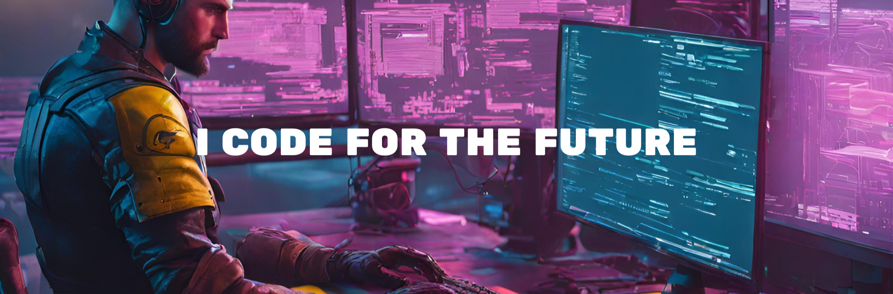

# 💫 About Me:
I am LuckyZ, A very enthusiastic person when it comes to programming. Have experience in building native apps using Flutter. Also, have experience using Laravel.

# 💻 Tech Stack:
                        	
# 📊 GitHub Stats:
 
 

### ✍️ Random Dev Quote

### 🔝 Top Contributed Repo

### 😂 Random Dev Meme

---

<!-- Proudly created with GPRM ( https://gprm.itsvg.in ) -->
